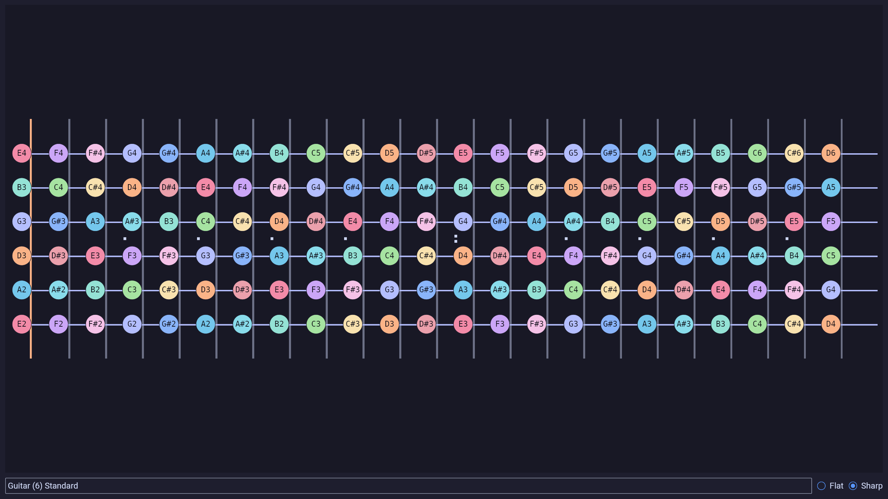

# Fretboard

A flexible fretboard visualization tool.



## Installation

### NixOS

`flake.nix`:
```nix
{
  inputs = {
    nixpkgs.url = "github:NixOS/nixpkgs/nixos-unstable";
    fretboard = {
      url = "github:rossnomann/fretboard";
      inputs.nixpkgs.follows = "nixpkgs";
    };
  };
  outputs = inputs: 
  let 
    system = "x86_64-linux";
    overlays = [ inputs.fretboard.overlays.${system}.default ];
  in {
    nixosConfigurations.default = inputs.nixpkgs.lib.nixosSystem {
      inherit system;
      modules = [
        (
          { pkgs, ... }:
          {
            config = {
              environment.systemPackages = [ pkgs.fretboard ];
              nixpkgs.overlays = overlays;
            };
          }
        )
      ];
  };
}
```

## Configuration

Default path: `$XDG_CONFIG_HOME/fretboard/config.kdl`
Use `FRETBOARD_CONFIG_PATH` environment variable to override the path.

Example:

```kdl
default {
  frets 24
  tuning "Guitar (6) Standard" // name from a tuning node
  note-format "sharp" // or flat
  // Theme: catppuccin-frappe, catppuccin-latte, catppuccin-macchiato, catppuccin-mocha
  theme-name "catppuccin-mocha"
}

tuning name="Guitar (6) Standard" "E2" "A2" "D3" "G3" "B3" "E4"
tuning name="Guitar (6) D Standard" "D2" "G2" "C3" "F3" "A3" "D4"
tuning name="Guitar (6) Drop C#" "Db2" "Ab2" "Db3" "Gb3" "Bb3" "Eb4"
tuning name="Bass (4) Standard" frets=24 "E1" "A1" "D2" "G2"
tuning name="Ukulele" frets=15 "G4" "C4" "E4" "A4"
```

## LICENSE

The MIT License (MIT)
